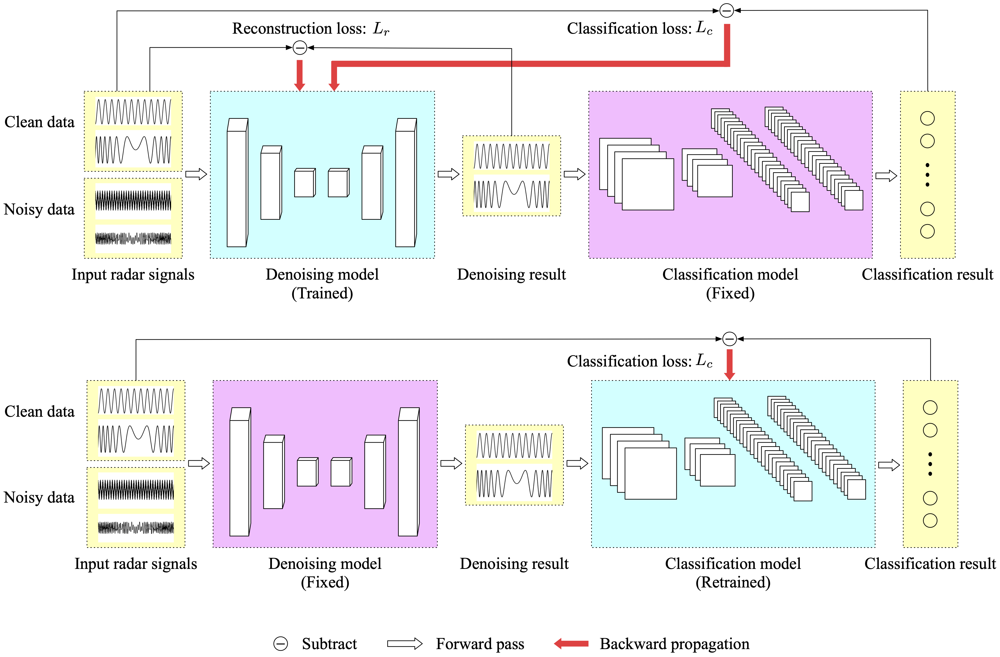

# DNCNet: Deep Radar Signal Denoising and Recognition

## Abstract

This is the official repository of the paper "DNCNet: Deep Radar Signal Denoising and Recognition" from IEEE Transactions on Aerospace and Electronic Systems (TAES). [paper link](https://ieeexplore.ieee.org/document/9721582)

## 1. Environment

Python >= 3.7.3

Pytorch >= 1.9.0 is recommended

Numpy

tqdm

h5py

## 2. Dataset

Self-built synthetic dataset and publicly available dataset are used. 

The self-built dataset is generated by Numpy, named "SIGNAL-8". It contains eight different radar signal types and can be split into two categories, i.e., the frequency modulation (FM) and phase modulation (PM). The FM signals consist of linear FM  (LFM, with positive and negative slope) and Sine FM (SFM). For PM signals, there are 64-bit polyphase code signals including Frank code, P1, P2, P3, and P4 code. Eight different electromagnetic environments are formed with AWGN based on the SNR, respectively, set to -10, -8, -5, -1, 5, 8, 10 dB, and noise free. Each signal type in a single environment has 2000 samples. The length of each signal sequence N is 1000. The details of the signal parameters are given in Tables III and IV of paper.

The other dataset, called "RADIOML 2018.01 A", is publicly available and was built by GNU radio tools proposed in this [paper](https://ieeexplore.ieee.org/document/8267032), consisting of 24 different analog and digital modulators including OOK, 4ASK, 8ASK, BPSK, QPSK, 8PSK, 16PSK, 32PSK, 16APSK, 32APSK, 64APSK, 128APSK, 16QAM, 32QAM, 64QAM, 128QAM, 256QAM, AM-SSB-WC,
AM-SSB-SC, AM-DSB-WC, AM-DSB-SC, FM, GMSK, and OQPSK. This dataset includes both synthetic simulated channel effects and over-the-air propagation loss covering a wide range of SNR levels from −20 to 30 dB with a step of 2 dB. The length of samples is 1024. Except for the AWGN used in the original dataset, we also use the Gaussian colored noise and impulse noise to generate some extra datasets (see, e.g., Section V-E in our paper) for more detailed methods validation and comparison.

## 3. Run

### (1) Model structure



### (2) Input

The input of the denoising model is the pairwise of noisy data and clean data. In the case of the "RadioML 2018.01 A" dataset, we introduce additive white Gaussian noise, colored Gaussian noise, and impulse noise to signals with an original signal-to-noise ratio (SNR) of 30dB. This process results in the creation of a new dataset with SNR values of 5dB, 1dB, and -1dB. Consequently, we can input these paired RadioML datasets into DNCNet.

### (3) Train

* train a classifier on the high-SNR dataset.
* run train.py to train the denoising model, all weights in classifier is frozen.
* run retrain.py to finetune the classifier, all weights in denoising model is frozen.

## 4. Citation

```
@ARTICLE{9721582,
  author={Du, Mingyang and Zhong, Ping and Cai, Xiaohao and Bi, Daping},
  journal={IEEE Transactions on Aerospace and Electronic Systems}, 
  title={DNCNet: Deep Radar Signal Denoising and Recognition}, 
  year={2022},
  volume={58},
  number={4},
  pages={3549-3562},
  doi={10.1109/TAES.2022.3153756}}
```

## 5. Contact

If you have any question about our work or code, please email dumingyang17@nudt.edu.cn.

## 6. Acknowledgement

The denoising model draws inspiration form the CBDNet, as proposed in the paper titled "Toward Convolutional Blind Denoising of Real Photographs" ([paper link](https://ieeexplore.ieee.org/document/8954448)) . The official code is [here](https://github.com/GuoShi28/CBDNet).
